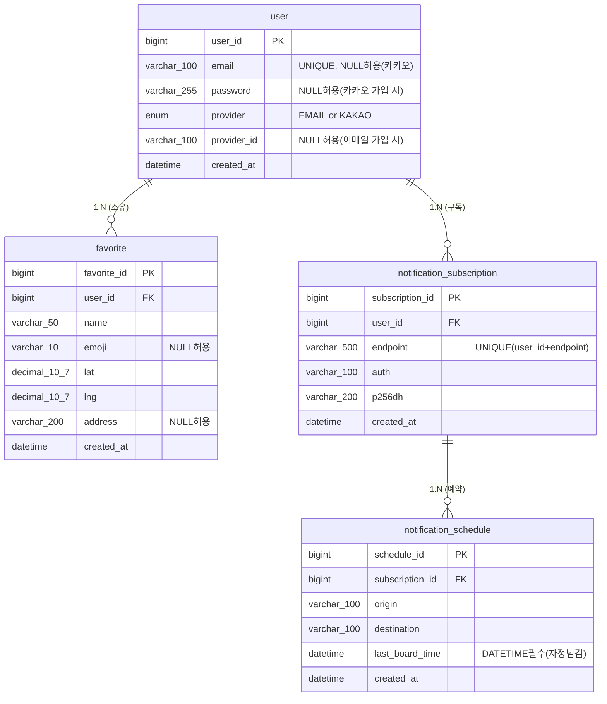

# ERD - 막차 알리미 (Last Train Notifier)

> 기준: `/docs/system-design.txt` (v2.0, 2026-05)
> 코드 기준 Entity: **없음** (스캐폴딩 단계 — Entity 구현 전)
> 생성일: 2026-05-11

---

## 분석 요약

| 항목 | 내용 |
|---|---|
| 분석 소스 | system-design.txt 섹션 9 (ERD), 섹션 6 (API), 섹션 11 (Scheduler) |
| DB 테이블 수 | 4개 |
| Entity 코드 | 없음 (scaffolding 단계) |
| route 테이블 | **없음** — ODsay 실시간 조회만 사용, DB 미저장 |
| refresh_token 컬럼 | **없음** — Redis (`RT:{userId}`, TTL 7일)로 관리 |

---

## 1. Entities (테이블 정의)

---

### 1.1 `user` — 사용자 계정

> 이메일 가입과 카카오 소셜 로그인을 하나의 테이블로 관리한다.
> provider 컬럼으로 가입 경로를 구분하고, provider_id로 카카오 사용자 식별자를 저장한다.
> Refresh Token은 이 테이블에 저장하지 않는다 (Redis 관리).

| 컬럼명 | 타입 | 제약 | 설명 |
|---|---|---|---|
| `user_id` | BIGINT | **PK**, AUTO_INCREMENT | 사용자 고유 식별자 |
| `email` | VARCHAR(100) | UNIQUE, NULL 허용 | 이메일 주소. 카카오 가입 시 NULL 가능 |
| `password` | VARCHAR(255) | NULL 허용 | BCrypt 해시값. 카카오 가입 시 NULL |
| `provider` | ENUM | NOT NULL, DEFAULT 'EMAIL' | 가입 경로: `EMAIL` \| `KAKAO` |
| `provider_id` | VARCHAR(100) | NULL 허용 | 카카오 사용자 ID. 이메일 가입 시 NULL |
| `created_at` | DATETIME | NOT NULL, DEFAULT NOW | 가입 일시 |

**인덱스 / 제약**
- `UNIQUE KEY uq_provider (provider, provider_id)` — 동일 카카오 계정 중복 가입 방지

**설계 결정사항**
- `refresh_token` 컬럼 없음: Redis `"RT:{userId}"` 키로 저장, TTL 7일 자동 만료
- `email UNIQUE` 제약: 이메일 중복 가입 차단. 이메일 중복 Race Condition은 DB 제약으로 최종 방어

---

### 1.2 `favorite` — 즐겨찾기 목적지

> 사용자가 자주 가는 목적지를 저장한다.
> 좌표(lat, lng)를 저장해 막차 조회 시 바로 사용할 수 있다.

| 컬럼명 | 타입 | 제약 | 설명 |
|---|---|---|---|
| `favorite_id` | BIGINT | **PK**, AUTO_INCREMENT | 즐겨찾기 고유 식별자 |
| `user_id` | BIGINT | **FK** → user.user_id, NOT NULL | 즐겨찾기 소유 사용자 |
| `name` | VARCHAR(50) | NOT NULL | 즐겨찾기 이름 (예: 집, 회사) |
| `emoji` | VARCHAR(10) | NULL 허용 | 이모지 (예: 🏠) |
| `lat` | DECIMAL(10,7) | NOT NULL | 위도 |
| `lng` | DECIMAL(10,7) | NOT NULL | 경도 |
| `address` | VARCHAR(200) | NULL 허용 | 도로명 주소 |
| `created_at` | DATETIME | NOT NULL, DEFAULT NOW | 등록 일시 |

**인덱스 / 제약**
- `INDEX idx_favorite_user (user_id)` — 특정 사용자의 즐겨찾기 목록 조회 성능
- `ON DELETE CASCADE` — 사용자 탈퇴 시 즐겨찾기 자동 삭제

**설계 결정사항**
- `DECIMAL(10,7)`: 소수점 7자리 = 약 1cm 오차 이내의 위경도 정밀도

---

### 1.3 `notification_subscription` — 웹 푸시 구독 정보

> 브라우저가 발급하는 Web Push 구독 정보를 저장한다.
> endpoint, auth, p256dh는 VAPID 방식의 Web Push 발송에 필요한 값이다.

| 컬럼명 | 타입 | 제약 | 설명 |
|---|---|---|---|
| `subscription_id` | BIGINT | **PK**, AUTO_INCREMENT | 구독 고유 식별자 |
| `user_id` | BIGINT | **FK** → user.user_id, NOT NULL | 구독 소유 사용자 |
| `endpoint` | VARCHAR(500) | NOT NULL | 브라우저 Push 서버 URL |
| `auth` | VARCHAR(100) | NOT NULL | VAPID 인증 키 (Base64) |
| `p256dh` | VARCHAR(200) | NOT NULL | 암호화 공개키 (Base64) |
| `created_at` | DATETIME | NOT NULL, DEFAULT NOW | 구독 일시 |

**인덱스 / 제약**
- `UNIQUE KEY uq_subscription (user_id, endpoint)` — 동일 사용자·브라우저 중복 구독 방지
- `ON DELETE CASCADE` — 사용자 탈퇴 시 구독 자동 삭제

---

### 1.4 `notification_schedule` — 막차 알림 예약

> 사용자가 예약한 막차 알림 정보를 저장한다.
> DB는 순수 데이터 저장소 역할만 수행.
> 알림 실행 상태는 Redis Delay Queue(notification:queue ZSET)가 관리한다.

| 컬럼명 | 타입 | 제약 | 설명 |
|---|---|---|---|
| `schedule_id` | BIGINT | **PK**, AUTO_INCREMENT | 알림 예약 고유 식별자 |
| `subscription_id` | BIGINT | **FK** → notification_subscription.subscription_id, NOT NULL | 연결된 구독 정보 |
| `origin` | VARCHAR(100) | NOT NULL | 출발지 명칭 |
| `destination` | VARCHAR(100) | NOT NULL | 목적지 명칭 |
| `last_board_time` | **DATETIME** | NOT NULL | 막차 탑승 마감 시각. **TIME 아닌 DATETIME 필수** |
| `created_at` | DATETIME | NOT NULL, DEFAULT NOW | 예약 등록 일시 |

> ~~`notify_30min`, `notify_10min`, `notified_30min`, `notified_10min`~~ 컬럼 제거됨.
> 알림 실행 상태는 Redis ZSET atomic pop으로 관리한다.

**인덱스 / 제약**
- `ON DELETE CASCADE` — 구독 삭제 시 알림 예약 자동 삭제
- 별도 폴링 인덱스 불필요 (DB polling 제거됨)

**⚠️ 중요: `last_board_time` 타입 결정 이유**

```
잘못된 예: TIME 타입 사용
  - 막차 00:10 (자정 이후) → TIME으로 저장하면 날짜 정보 없음
  - 30분 전 발송 시각 = 전날 23:40 → 계산 불가능

올바른 예: DATETIME 타입 사용
  - 막차 2026-05-12 00:10 → 30분 전 = 2026-05-11 23:40 정상 계산
```

---

## 2. Relationships (테이블 관계)

```
user (1) ──────────────────── (N) favorite
  └─ 한 사용자가 여러 즐겨찾기를 가질 수 있다

user (1) ──────────────────── (N) notification_subscription
  └─ 한 사용자가 여러 기기(브라우저)에서 구독할 수 있다

notification_subscription (1) ── (N) notification_schedule
  └─ 하나의 구독에 여러 알림 예약이 등록될 수 있다
```

| 관계 | 타입 | ON DELETE |
|---|---|---|
| user → favorite | 1:N | CASCADE |
| user → notification_subscription | 1:N | CASCADE |
| notification_subscription → notification_schedule | 1:N | CASCADE |

**N:M 관계가 없는 이유**

막차 알리미 서비스는 "사용자가 자신의 즐겨찾기/알림을 직접 관리"하는 구조이므로 N:M 관계가 발생하지 않는다.

---

## 3. ERD Diagram (Mermaid)



---

## 4. Redis 저장 항목 (DB 외 영속성)

> DB 테이블이 아니지만, 영속성 설계의 일부로 함께 기록한다.

| Key 패턴 | 타입 | TTL | 용도 |
|---|---|---|---|
| `RT:{userId}` | String | 7일 | Refresh Token 저장 |
| `odsay:route:{sx}:{sy}:{ex}:{ey}:{dayType}` | String | 1시간 | ODsay 경로 응답 캐싱 |
| `notification:queue` | ZSET | 없음 (발송 후 자동 제거) | 알림 Delay Queue (score = epoch ms) |

---

## 5. 코드 vs 설계 문서 차이점

| 항목 | 코드 상태 | 설계 문서 내용 | 비고 |
|---|---|---|---|
| Entity 클래스 | **없음** (미구현) | 4개 Entity 예정 | 스캐폴딩 단계 |
| DDL / 마이그레이션 파일 | **없음** | 설계 문서에 DDL 정의됨 | 구현 필요 |
| `route` 테이블 | 없음 | 없음 (일치) | ODsay 실시간, DB 불필요 |
| `user.refresh_token` 컬럼 | 없음 | 없음 (일치) | Redis 관리 |

---

## 6. 구현 시 주의사항

### 반드시 지켜야 할 것

```sql
-- ✅ 올바른 DDL (자정 넘김 처리 가능)
last_board_time DATETIME NOT NULL

-- ❌ 잘못된 DDL (자정 넘김 처리 불가능)
last_board_time TIME NOT NULL
```

### Entity 구현 순서 (의존성 고려)

```
1단계: User        (다른 모든 테이블이 참조하는 루트)
2단계: Favorite    (User만 의존)
3단계: NotificationSubscription  (User만 의존)
4단계: NotificationSchedule      (NotificationSubscription 의존)
```

### 추후 확인 필요 (⚠️ 불확실 항목)

- `email` NULL 허용 범위: 카카오 가입 사용자가 이메일을 제공하지 않을 경우 NULL 처리 방식
  → 카카오 프로필에서 이메일 동의 항목 확인 후 결정 필요
- `favorite.emoji` 컬럼 길이: 이모지 1개는 최대 4바이트(UTF-8 4-byte)
  → MySQL `utf8mb4` 문자셋 설정 필수, VARCHAR(10)은 글자 수 기준이므로 실제 저장은 가능